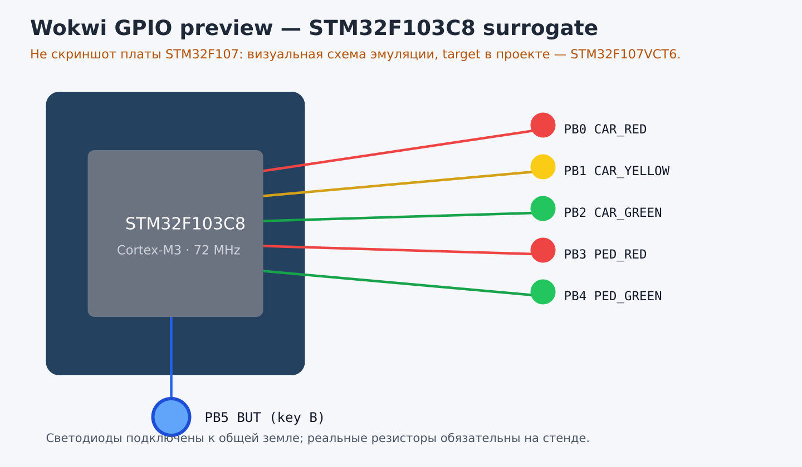

# Лабораторная работа №1 — STM32. Светофор

**Предмет:** Программирование киберфизических систем  
**Микроконтроллер:** STM32F107VCT6  
**Среда:** STM32CubeIDE + STM32CubeF1 1.8.x  
**Исходная методичка:** лабораторная работа «Знакомство и настройка STM32. Светофор».

## 1. Цель и результат

Настроить проект STM32CubeIDE, включить отладку ST-Link и тактирование от внешнего
кварца на 72 МГц, настроить GPIO и реализовать светофор с кнопкой для управления
автомобильным и пешеходным движением.

Проект находится в [`project/`](project/). Файл `TrafficLight.ioc` можно открыть в
STM32CubeIDE, после чего IDE сгенерирует стандартные HAL-файлы. Пользовательская
логика уже находится в `Core/Src/main.c` между маркерами `USER CODE`, поэтому она
сохраняется при повторной генерации.

## 2. Структура

```text
lab-01-stm32-traffic-light/
├── project/
│   ├── TrafficLight.ioc
│   └── Core/
│       ├── Inc/main.h
│       └── Src/main.c
├── diagrams/traffic-light-state.mmd
├── evidence/{pin-map.md,wokwi-preview.svg,wokwi-preview.png}
├── simulation/wokwi/{diagram.json,wokwi.toml}
└── REPORT.md
```

В DOCX нет отдельного шаблона отчёта или требования к ГОСТ-оформлению; поэтому
отчёт содержит цель, конфигурацию, карту выводов, алгоритм, исходный код и
проверки. Рабочее имя проекта и пути не содержат кириллицу, как требует методичка.

## 3. Конфигурация STM32CubeIDE

1. Установить STM32CubeIDE и пакет STM32CubeF1 из материалов преподавателя или с
   официального сайта ST.
2. Открыть `TrafficLight.ioc` и выбрать STM32F107VCT6.
3. Включить `SYS → Debug = Serial Wire` для ST-Link.
4. Включить HSE и PLL x9: при внешнем кварце 8 МГц получается SYSCLK 72 МГц;
   APB1 делится на 2, APB2 работает без деления.
5. Проверить GPIO согласно [карте выводов](evidence/pin-map.md), нажать Generate
   Code, собрать проект молотом и прошить через Run/ST-Link.

Для локальных установщиков и архивов пакетов использована папка из задания:
[методички STM32 на Яндекс Диске](https://disk.yandex.ru/d/VaEXMcsKR0Q4UA/%D0%BC%D0%B5%D1%82%D0%BE%D0%B4%D0%B8%D1%87%D0%BA%D0%B8).
В репозиторий установщики и проприетарные пакеты не копируются.

## 4. Алгоритм светофора

В обычном состоянии автомобилям разрешён зелёный, пешеходам — красный. Нажатие
кнопки фиксируется по переходу в активный низкий уровень; повторные удержания не
создают очередь запросов. После минимальных 3 секунд автомобильного зелёного
выполняется последовательность:

| Состояние | Автомобили | Пешеходы | Время |
|---|---|---|---:|
| `CAR_GREEN` | зелёный | красный | ожидание кнопки |
| `CAR_YELLOW` | жёлтый | красный | 2 с |
| `ALL_RED_TO_PEDESTRIANS` | красный | красный | 1 с |
| `PED_GREEN` | красный | зелёный | 7 с |
| `PED_BLINK` | красный | мигающий зелёный | 4 с |
| `ALL_RED_TO_CARS` | красный | красный | 1 с |

После этого снова включается `CAR_GREEN`. Таймер основан на `HAL_GetTick()`, поэтому
основной цикл не блокируется длинными задержками; `HAL_Delay(10)` задаёт частоту
опроса кнопки и обновления состояния.

## 5. Проверка

- статически проверены наличие `.ioc`, HAL-маркеров `USER CODE` и всех шести
  назначенных сигналов;
- хостовый тест `tests/run-host-tests.sh` проходит полную последовательность
  состояний и проверяет отсутствие одновременного зелёного у обоих потоков;
- `wokwi-cli 0.28.1 lint simulation/wokwi/diagram.json` завершился без ошибок;
- алгоритм содержит безопасные промежуточные состояния `ALL_RED`, чтобы не
  включать конфликтующие направления одновременно;
- кнопка использует pull-up и программную фиксацию нажатия;
- сборка и прошивка должны выполняться на компьютере с STM32CubeIDE, STM32CubeF1,
  ARM GCC, ST-Link и подключённой платой. На текущем хосте эти инструменты и
  физическая плата отсутствуют, поэтому аппаратный smoke-test здесь не заявляется.

После прошивки ожидается: без нажатия горят `CAR_GREEN` и `PED_RED`; после кнопки
происходит полный цикл с миганием `PED_GREEN`, затем возвращается исходное состояние.

## 6. Эмуляция и иллюстрация

Для визуальной проверки добавлен [Wokwi-каталог](simulation/wokwi/). Wokwi официально
поддерживает STM32F103C8 Blue Pill с Cortex-M3, GPIO, SysTick и RCC, но STM32F107VCT6
в списке поддерживаемых чипов нет. Поэтому это честно обозначенная surrogate-схема:
она проверяет соединения PB0–PB5 и поведение кнопки, но не заменяет прошивку целевой
платы. [Схема Wokwi](simulation/wokwi/diagram.json) и [визуальный preview](evidence/wokwi-preview.svg)
добавлены в отчёт как иллюстрации; preview не выдаётся за снимок реального стенда.



## 7. Ограничения

Схема стенда в методичке показывает доступные GPIO, но не задаёт конкретную внешнюю
распайку всех пяти светодиодов. Поэтому распиновка вынесена в `.ioc` и отдельную
таблицу; при другой полярности стенда достаточно инвертировать уровни в `SetLights`.
